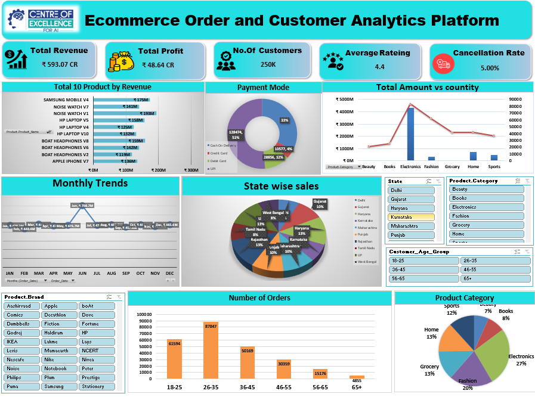

# 📊 E-Commerce Order and Customer Analytics Platform

An Excel-based data analytics project that transforms e-commerce customer, product, and order data into meaningful business insights through data cleaning, data integration, KPI analysis, Pivot Tables, and an interactive dashboard.

---

## 📌 Project Overview

The **E-Commerce Order and Customer Analytics Platform** consolidates Customer, Product, and Sales/Order data into a unified Master Data model.

The project analyzes:

- Revenue and Profitability
- Customer behavior
- Product and category performance
- Brand performance
- State-wise sales
- Payment methods
- Customer age groups
- Monthly revenue trends
- Order status and fulfillment
- Cancellation performance

The final output is an interactive **Microsoft Excel Dashboard** that provides a single view of important business KPIs and insights.

---

## 🎯 Project Objectives

- Clean and organize e-commerce data
- Integrate Customer, Product, and Sales data
- Create a Master Data model
- Calculate important business KPIs
- Analyze sales and profitability
- Analyze customer segments
- Analyze payment and geographic trends
- Analyze order fulfillment
- Build an interactive Excel dashboard
- Generate actionable business insights

---

# 🔍 Key Business Insights

- 📱 **Electronics dominates revenue:** Contributes **72.6%** of total revenue.
- 👑 **Platinum customers drive value:** **68.4%** of customers contribute **93.9%** of lifetime spend.
- 👥 **26–35 is the largest segment:** Generates **87,847 orders**.
- 💳 **UPI is the leading payment method:** Accounts for **51.4%** of orders.
- 🌎 **Uttar Pradesh leads revenue:** Generates approximately **₹76.8 Cr**.
- 📦 **Strong delivery performance:** **80.1%** of orders are delivered.
- 💰 **Profitability:** ₹593.1 Cr revenue generates ₹48.6 Cr profit with an **8.2% margin**.
- 📈 **Stable revenue trend:** Monthly revenue remains between approximately **₹21.5–24.8 Cr**.
- 🔄 **Improvement opportunity:** Returns and cancellations each account for approximately **5%** of orders.
- 🎯 **Business focus:** Improve category diversification, customer retention, profitability, and fulfillment performance.

---

# 📊 Dashboard Preview

## 🛠️ Tools & Technologies

- Microsoft Excel
- Excel Tables
- Data Cleaning
- Data Integration
- Pivot Tables
- Pivot Charts
- Excel Dashboard
- KPI Analysis
- Data Visualization
- Business Analytics

